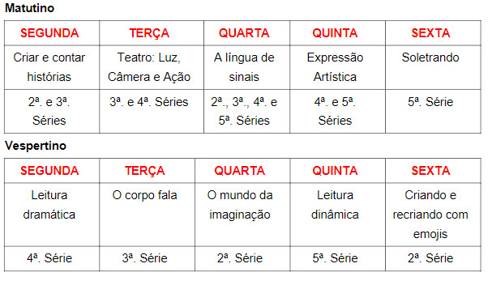

# Checkpoint 1 - 2º semestre - Computional Thinking

## Objetivo
Montar um sistema de cadastro de alunos e cadastro deles em oficinas de um evento literário de uma escola com crianças da 2ª á 5ª serie.

## Regras
R01 -> No cadastro de alunos, ao digitar o rm = 0, o sistema para o cadastro.

R02 -> O sistema permite apenas fazer o cadastro e alunos somente uma vez.

R03 -> Não podem haver alunos com o mesmo rm.

R04 -> Cada oficina pode ter no máximo até 10 alunos cadastrados.

R06 -> Cada aluno pode se inscrever no máximo em até 3 oficinas.

R07 -> O aluno não pode se inscrever mais de uma vez na mesma oficina.

## Aprendizado
Manipulação de dados utilizando vetores e matrizes.